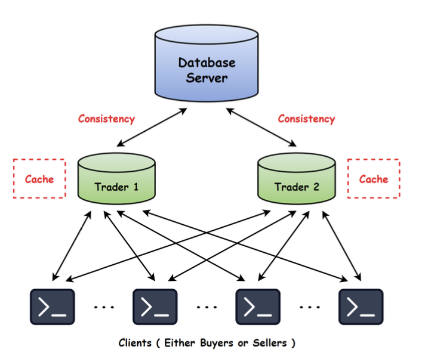

   

# Peer-to-Peer Marketplace



## 📜 Project Overview
This project simulates a decentralized peer-to-peer (P2P) marketplace where buyers and sellers trade goods directly through distributed nodes. The system uses gRPC to enable communication between peers, mimicking real-world distributed environments. Traders manage transactions, while the warehouse stores inventory data. The project emphasizes fault tolerance, cache consistency, and leader election to ensure smooth and reliable trading.

##  🚀 Key Features
- **Decentralized Marketplace** – No central authority, nodes communicate directly (both client/server).
- **gRPC Integration** – Efficient communication between marketplace nodes.
- **Dynamic Topology** – Nodes can join or leave dynamically.
- **Fault Tolerance** – Trader failover is managed through heartbeat protocols.
- **Cache Consistency** – Push-based model ensuring real-time updates.
- **Leader Election** – Bully algorithm to elect primary and secondary traders.

## 🎨 Design Overview
- **Peer Isolation** – Each peer operates as an independent process with no shared memory.
- **Bully Election Algorithm** – Elects primary and secondary traders.
- **Warehouse Synchronization** – Buyers/sellers update warehouse stock via traders.
- **Heartbeat Monitoring** – Traders exchange heartbeat signals every 5 seconds.
- **Failover Mechanism** – Trader failures trigger reassignment of pending requests.
- **Cache Management** – Transactions logged and cache updated after each request.
- **Priority Queues** – Lamport clock-based ordering to ensure sequential processing.
- **Concurrency Handling** – Locks to prevent race conditions in the warehouse.

##  📂 Project Structure
```
p2p-marketplace-main/
│
├── bazaar.proto             # Protocol buffer definitions
├── bazaar_pb2.py            # gRPC generated code (message classes)
├── bazaar_pb2_grpc.py       # gRPC generated code (services)
├── config_buyers_sellers.json # Configuration for buyers and sellers
├── peer_cache.py            # Peer cache management
├── run_nodes.py             # Main script to initiate marketplace nodes
├── stock.json               # Stock data
├── topology.json            # Topology configuration
└── warehouse.py             # Warehouse management logic
```

## 🔧 How to Run
1. Install dependencies:
```bash
pip install requirements.txt
```

2. Configure nodes by modifying `config_buyers_sellers.json` and `topology.json`.

3. Run the nodes:
```bash
python run_nodes.py
```

## 💻 Configuration
- **config_buyers_sellers.json** – Defines roles, prices, and initial conditions for buyers and sellers.
- **topology.json** – Sets up network connections between nodes.
- **stock.json** – Represents available inventory in the warehouse.


📚 Please check [here](./design-doc.pdf) for more information.

👨‍💻👩‍💻 *Developed by **Aishwarya** and [Vara Prasad](https://www.github.com/GudiVaraprasad)*

💡 Idea based on COMPSCI 677 Course Labs:
[Lab 1](http://lass.cs.umass.edu/~shenoy/courses/spring16/labs/lab1.html ), [Lab 2](http://lass.cs.umass.edu/~shenoy/courses/spring16/labs/lab2.html ), [Lab 3](http://lass.cs.umass.edu/~shenoy/courses/spring16/labs/lab3.html)
